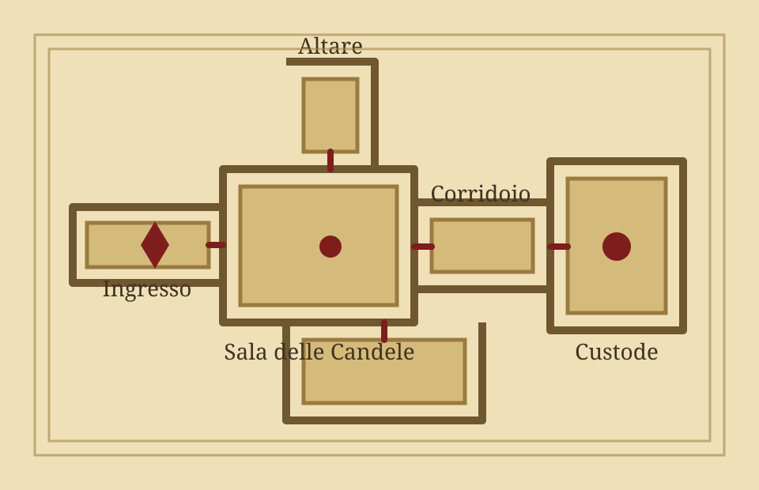

# Guida Authoring

<p class="subtitle">Scrivere, controllare e pubblicare contenuti senza uscire dal flusso Markdown.</p>

## Flusso consigliato

1. Crea un documento da template.
2. Apri la Markdown Preview di VS Code per il controllo rapido del testo.
3. Avvia la preview espansa in watch quando usi include o sintassi breve.
4. Scrivi in `docs/` usando snippet HTML per VS Code o sintassi breve per schema/build.
5. Salva il file e aggiorna il browser.
6. Prima dell'export esegui `npm run check`.
7. Prima di considerare chiuso il layout genera il PDF.

```sh
npm run new -- adventure "La Torre Sommersa"
npm run preview:watch
```

La preview sarà disponibile su `http://127.0.0.1:8081/`.

## Regola PDF-first

La preview serve a scrivere piu velocemente, ma il formato primario della suite e il PDF A4. Dopo modifiche a componenti, immagini, tabelle, colonne o statblock controlla sempre:

```sh
npm run build:book:pdf
npm run qa:pdf
```

Nel PDF nessun box dovrebbe sovrapporsi a testo, cornici, immagini o tabelle. Se un contenuto e lungo, preferisci dividerlo in sottosezioni o togliere `no-break` dal blocco interessato invece di forzarlo dentro una singola pagina.

## Due modi di scrivere

Usa gli snippet HTML quando vuoi che anche la Markdown Preview nativa di VS Code mostri il componente gia stilizzato. Questa e la modalita migliore per scrittura lunga in VS Code:

```html
<aside class="readaloud no-break">
  <div class="readaloud__label">Da leggere al tavolo</div>
  <p>Le torce proiettano ombre innaturali sulle colonne spezzate.</p>
</aside>
```

Usa la sintassi breve quando vuoi scrivere piu rapidamente e controllare tutto nella preview espansa, nell'editor locale e nella build:

```md
::: readaloud Da leggere al tavolo
Le torce proiettano ombre innaturali sulle colonne spezzate.
:::
```

## Snippet utili

Snippet HTML per Markdown Preview nativa:

- `frontttrpg`
- `readaloud`
- `encounter`
- `treasure`
- `note`
- `quote`
- `monster`
- `spell`
- `magicitem`
- `npc`
- `location`
- `hazard`
- `randomtable`
- `map`
- `image`
- `include`

Snippet rapidi per preview espansa:

- `qreadaloud`
- `qencounter`
- `qtreasure`
- `qnote`
- `qmap`
- `qimage`

## Include riusabili

Metti componenti ricorrenti in `content/` e includili nei documenti:

```html
<rpg-include src="content/monsters/custode-ossa.html"></rpg-include>
```

La Markdown Preview nativa mostra un placeholder leggibile per il tag. `npm run preview:watch` mostra invece il contenuto espanso.

## Guardrail visuali e licenza

Il progetto punta a output `5E compatible` con identita originale. Non usare loghi, marchi, impaginati o asset proprietari del publisher ufficiale. I criteri operativi sono raccolti in `docs/design-guardrails.md`.

## Mappe e immagini

Ogni immagine locale deve essere dichiarata in `assets/manifest.json`.

Sintassi HTML, utile nella Markdown Preview:

```html
<figure class="rpg-map no-break">
  
  <figcaption>Mappa del Santuario Sepolto</figcaption>
</figure>
```

Sintassi breve, utile in preview espansa:

```md
::: map Mappa del Santuario Sepolto
src: ../assets/images/maps/santuario-sepolto-map.svg
alt: Mappa del Santuario Sepolto
:::
```

`npm run check:assets` segnala immagini locali non dichiarate nel manifest.

## Prima di pubblicare

```sh
npm run check
npm run build:book:pdf
npm run qa:pdf
npm run export:package
```

Usa `npm run export:package:pdf` se vuoi rigenerare e includere anche il PDF.
